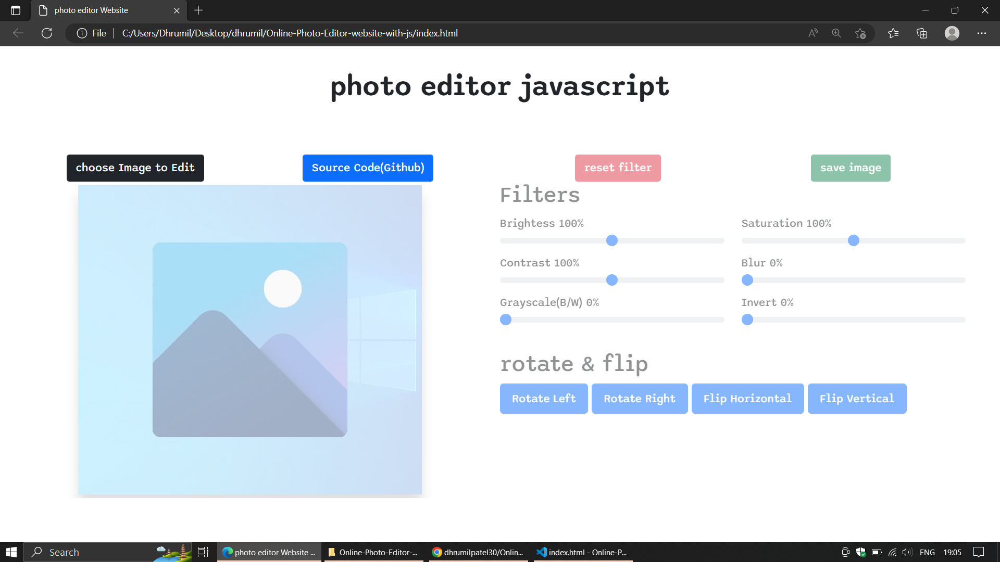
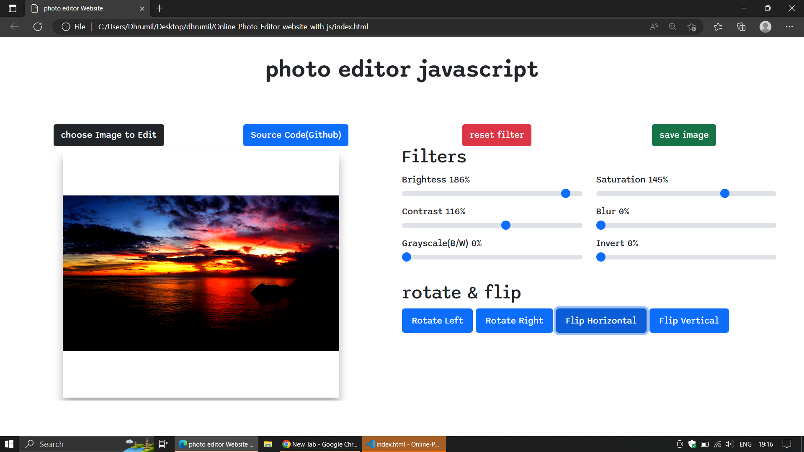

# Online-Photo-Editor-website-with-js

Any suggestion regarding updates are welcome
and features addition like crop image and ai beutify will also be added soon.
## Table of contents
* [General info](#general-info)
* [Usage](#Usage)
* [Technologies](#technologies-used)
* [Some screenshots](#Preview)

## General info:
This project is simple static website made from js.
This website has main basic functionality needed for photo editor.

## Usage:
###### Preview Available at
[here on netlify hosted website](https://photoeditorjs.netlify.app/)

## Technologies used:
Project is created with:
* HTML
* CSS
* JavaScript
* jQuery
* Bootstrap

## Preview:

